# Frontend Framework Performance Comparison

Published on [Medium](https://medium.com/@drew.robi/frontend-framework-performance-comparison-382dbf20b9de)

## Key Findings

| Category               | Winner          | Runner-up        |
| ---------------------- | --------------- | ---------------- |
| **Initial Load (FCP)** | Angular (80ms)  | Solid (92ms)     |
| **Bundle Size**        | Solid (257KB)   | Lit (265KB)      |
| **Filter Performance** | Solid (78ms)    | React (92ms)     |
| **Clear Filters**      | Solid (208ms)   | React (355ms)    |
| **Navigate to Detail** | Solid (170ms)   | Lit (170ms)      |
| **Back to List**       | React (197ms)   | Solid (281ms)    |
| **Pagination Cycle**   | Solid (1,490ms) | Svelte (1,543ms) |
| **Detail Navigation**  | Solid (331ms)   | React (336ms)    |
| **Overall**            | **SolidJS**     | **React**        |

## Table of Contents

- [Key Findings](#key-findings)
- [Overview](#overview)
  - [Background](#background)
  - [Frameworks Compared](#frameworks-compared)
- [Methodology](#methodology)
  - [Test Environment](#test-environment)
  - [Test Execution](#test-execution)
- [Application Design](#application-design)
  - [List View](#list-view)
  - [Detail View](#detail-view)
- [Performance Scenarios](#performance-scenarios)
  - [Initial Load Tests](#initial-load-tests)
  - [Change Detection Tests](#change-detection-tests)
  - [Navigation Tests](#navigation-tests)
  - [Build Metrics](#build-metrics)
- [Results](#results)
  - [Initial Page Load](#initial-page-load)
  - [Filter Application](#filter-application)
  - [Clear Filters](#clear-filters)
  - [Expand/Collapse](#expandcollapse)
  - [Navigate to Detail](#navigate-to-detail)
  - [Navigate Back to List](#navigate-back-to-list)
  - [Pagination Cycle](#pagination-cycle)
  - [Detail Navigation Cycle](#detail-navigation-cycle)
  - [Bundle Sizes](#bundle-sizes)
  - [Overall Comparison](#overall-comparison)
- [Limitations](#limitations)
- [Resources](#resources)

## Overview

A performance comparison of five modern frontend frameworks (December 2025).

### Background

I was disappointed to find limited benchmarks comparing frontend frameworks in scenarios that reflect real business applications—specifically, applications with large numbers of components and client-side routing.

To address this gap, I built a custom "Food Facts" application. It uses pre-generated data served by a local backend, ensuring the data order is deterministic and network variability doesn't skew results. This setup provides realistic HTTP fetching behavior while isolating framework performance.

### Frameworks Compared

| Framework | Version | Build Tool                    | Router                 |
| --------- | ------- | ----------------------------- | ---------------------- |
| Angular   | 21.0.3  | Angular CLI / esbuild         | @angular/router        |
| React     | 19.2.1  | Vite 7.1.7                    | react-router-dom 7.3.2 |
| Svelte    | 5.33.0  | SvelteKit 2.21.0 / Vite 6.3.0 | SvelteKit routing      |
| SolidJS   | 1.9.10  | Vite 7.2.4                    | @solidjs/router 0.15.3 |
| Lit       | 3.2.0   | Vite 7.2.4                    | @lit-labs/router 0.1.3 |

All projects use TypeScript ~5.9.3 and share types via a workspace package (`shared-types`).

## Methodology

### Test Environment

- **Machine**: MacBook Pro 15-inch, 2018
- **Processor**: 2.6 GHz 6-Core Intel Core i7
- **Memory**: 16 GB 2400 MHz DDR4
- **Graphics**: Intel UHD Graphics 630 1536 MB
- **OS**: macOS Sequoia 15.7.2
- **Browser**: Chromium (via Puppeteer)

### Test Execution

- **Automation**: Puppeteer-based test runner
- **Runs per scenario**: 5 runs per framework per scenario
- **Metrics reported**: Median values (to reduce outlier impact)
- **Backend**: Local Node.js server serving cached JSON data
- **Network**: Localhost (minimal network latency)

Each framework was tested sequentially with the same test scenarios. The test runner
waits for network idle and specific DOM elements before measuring to ensure consistent
comparison points.

## Application Design

Each framework implementation shares identical HTML structure and CSS styling as much as possible. The application consists of two pages: a list view and a detail view.

### List View

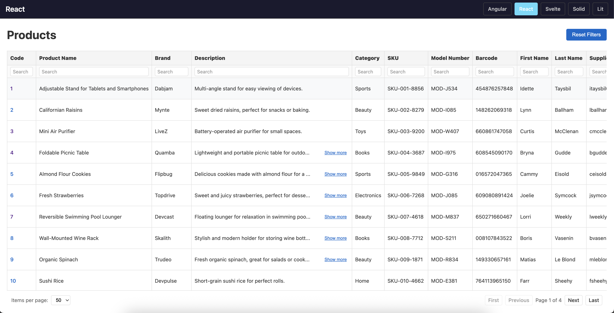

The initial page is a list view with **54 columns** and **50 rows**, rendering **~1,600 components** on screen. The columns use 16 different component types to render various data formats:

| Component Type   | Description                      | Example Columns                    |
| ---------------- | -------------------------------- | ---------------------------------- |
| `simple-text`    | Plain text display               | Product Name, Brand, Category, SKU |
| `truncated-text` | Expandable text with "show more" | Description                        |
| `product-link`   | Clickable link to detail page    | Code                               |
| `progress-bar`   | Visual percentage bar            | Quality Score, Eco Score           |
| `grade-badge`    | Letter grade (A-F) badge         | Grade                              |
| `nova-dots`      | 1-4 dot rating display           | Safety Rating                      |
| `star-rating`    | 5-star rating component          | Customer Rating                    |
| `large-counter`  | Formatted number display         | Stock, Units Sold, Reviews         |
| `decimal-units`  | Number with unit suffix          | Price, Weight, Tax Rate            |
| `absolute-date`  | Formatted date                   | Created, Release Date              |
| `relative-date`  | "X days ago" format              | Last Updated                       |
| `time-format`    | Time display (HH:MM)             | Departure Time                     |
| `boolean-yesno`  | Yes/No badge                     | In Stock, Featured, Best Seller    |
| `product-image`  | Thumbnail image                  | Image                              |
| `color-pill`     | Color swatch with name           | Color                              |

The list supports:

- **Filtering**: Text search, range sliders, and multi-select dropdowns
- **Pagination**: Navigate through pages of 50 items
- **Detail navigation**: Click product code to view details

### Detail View

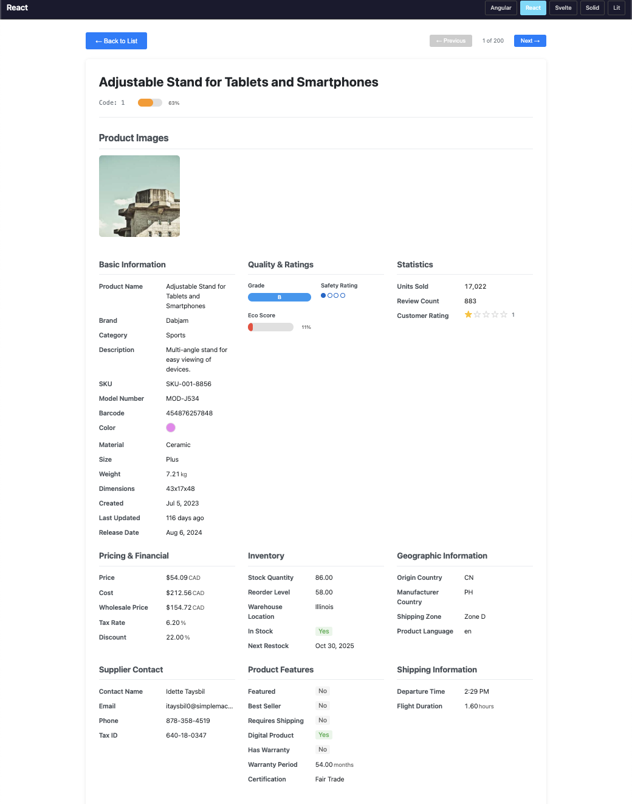

Clicking a product code navigates to the detail page, which displays the same data fields in a different layout with a larger image—rendering only **~35 components**.

> **Component counts measured using Angular with lifecycle instrumentation. All frameworks use identical HTML structure, so counts are consistent across implementations.**

The detail page includes:

- **Previous/Next navigation**: Move between products without returning to the list
- **Back to list**: Return to the list view

## Performance Scenarios

### Initial Load Tests

- **Initial page load**
  - **Purpose**: Tests bootstrapping and load times
  - **Metrics**: First Contentful Paint (FCP), Largest Contentful Paint (LCP), Time to Interactive (TTI), Total Blocking Time (TBT), bundle size

### Change Detection Tests

- **Filter application**
  - **Purpose**: Hybrid test for component creation, destruction, and change detection
  - **Action**: Apply a text filter that reduces 50 rows to 11 rows

- **Clear filters**
  - **Purpose**: Tests component creation time when restoring full dataset
  - **Action**: Clear all filters, restoring from 11 rows back to 50 rows

- **Expand/collapse description**
  - **Purpose**: Tests minimal reactive change on a complex page
  - **Action**: Expand truncated text, then collapse it

- **Pagination cycle**
  - **Purpose**: Tests component re-rendering with data changes
  - **Action**: Navigate through 4 page transitions (next, next, previous, previous)
  - **Note**: Components are tracked by index, ensuring updates rather than full recreation

### Navigation Tests

- **Navigate to detail**
  - **Purpose**: Tests destroying many components and creating fewer
  - **Action**: Click product link to navigate from list (~1,600 components) to detail (~35 components)

- **Navigate back to list**
  - **Purpose**: Tests list view creation without cold-start overhead
  - **Action**: Navigate from detail back to list view

- **Detail navigation cycle**
  - **Purpose**: Tests component updates without recreation
  - **Action**: Navigate between detail pages using next/previous buttons

### Build Metrics

- **Build metrics**
  - **Purpose**: Measure non-runtime performance characteristics
  - **Metrics**: Bundle size, number of requests, largest request size

## Results

### Initial Page Load

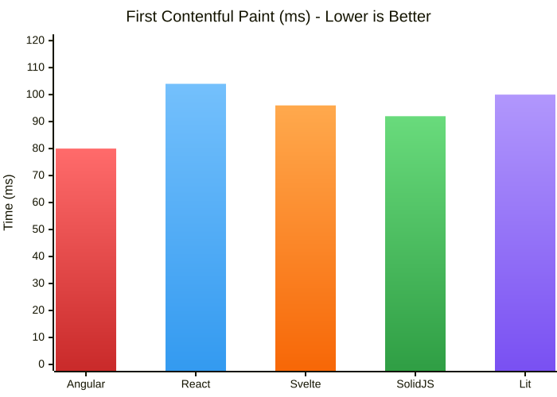

| Framework | FCP (ms) | LCP (ms) | TTI (ms) | Bundle Size (KB) |
| --------- | -------- | -------- | -------- | ---------------- |
| Angular   | **80**   | **80**   | **10**   | 501              |
| React     | 104      | 104      | 11       | 451              |
| Svelte    | 96       | 96       | 13       | 307              |
| SolidJS   | 92       | 92       | 12       | **257**          |
| Lit       | 100      | 100      | 13       | 265              |

**Winner**: Angular (fastest FCP/LCP) | **Best Bundle**: SolidJS (257KB)

### Filter Application

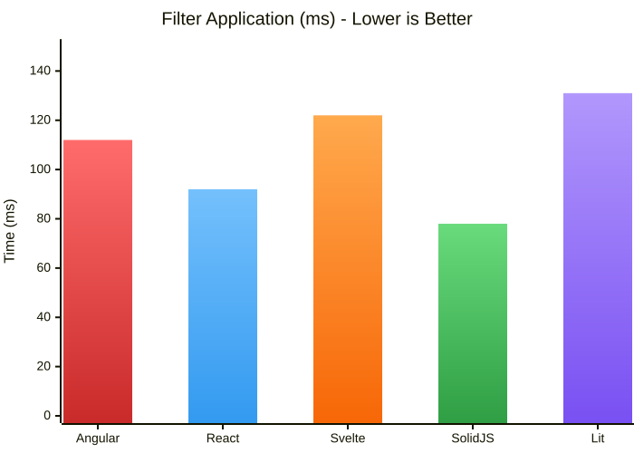

| Framework | Filter Duration (ms) | JS Execution (ms) |
| --------- | -------------------- | ----------------- |
| Angular   | 112                  | 112               |
| React     | 92                   | 92                |
| Svelte    | 122                  | 122               |
| SolidJS   | **78**               | **78**            |
| Lit       | 131                  | 131               |

**Winner**: SolidJS (78ms) - 15% faster than React

### Clear Filters

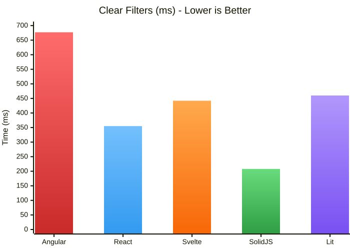

| Framework | Clear Duration (ms) | Restored Rows |
| --------- | ------------------- | ------------- |
| Angular   | 677                 | 50            |
| React     | 355                 | 50            |
| Svelte    | 442                 | 50            |
| SolidJS   | **208**             | 50            |
| Lit       | 460                 | 50            |

**Winner**: SolidJS (208ms) - 41% faster than React, 69% faster than Angular

### Expand/Collapse

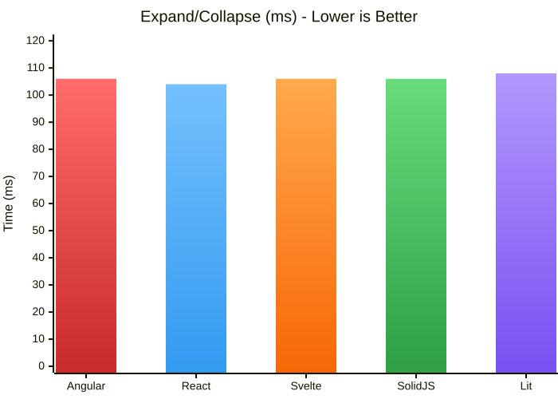

| Framework | Expand (ms) | Collapse (ms) |
| --------- | ----------- | ------------- |
| Angular   | 107         | 105           |
| React     | **104**     | **104**       |
| Svelte    | 106         | 106           |
| SolidJS   | 106         | 105           |
| Lit       | 107         | 108           |

**Winner**: React (tied with others) - All frameworks perform similarly for minimal changes

### Navigate to Detail

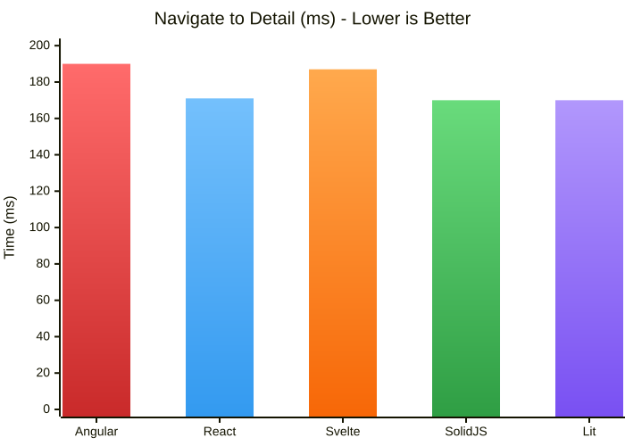

| Framework | Navigation Time (ms) | Detail LCP (ms) |
| --------- | -------------------- | --------------- |
| Angular   | 190                  | **84**          |
| React     | 171                  | 100             |
| Svelte    | 187                  | 92              |
| SolidJS   | **170**              | 92              |
| Lit       | **170**              | 86              |

**Winner**: SolidJS/Lit (tied at 170ms)

### Navigate Back to List

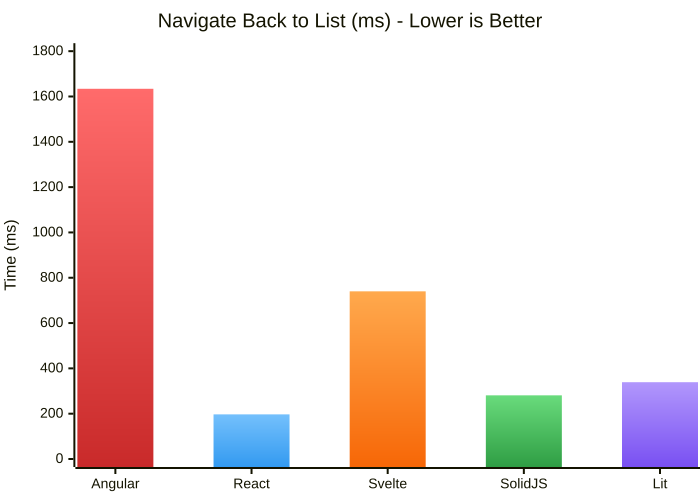

| Framework | Back Navigation (ms) |
| --------- | -------------------- |
| Angular   | 1,634                |
| React     | **197**              |
| Svelte    | 740                  |
| SolidJS   | 281                  |
| Lit       | 339                  |

**Winner**: React (197ms) — **8x faster** than Angular, 2.7x faster than Svelte

This is the most striking result. Chrome DevTools performance profiling revealed Angular's slower times are due to significantly longer script execution during component recreation. React's functional component model may contribute to its advantage here, potentially reducing object creation overhead compared to class-based approaches.

### Pagination Cycle

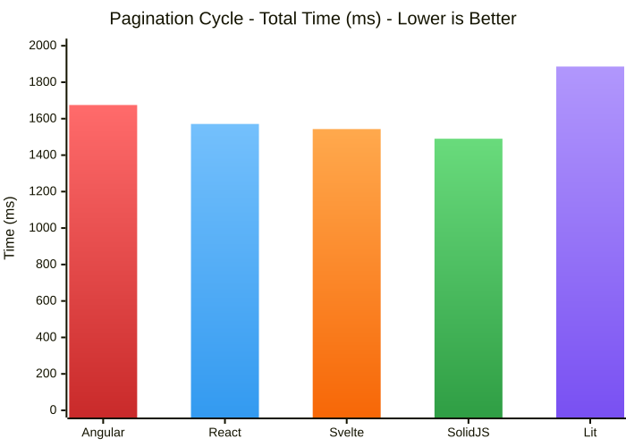

*Note: This test navigates through 4 page transitions (1→2→3→2→1). "Total Cycle" is the cumulative time for all 4 transitions.*

| Framework | Total Cycle (ms) | Avg Page Transition (ms) |
| --------- | ---------------- | ------------------------ |
| Angular   | 1,675            | 333                      |
| React     | 1,571            | 301                      |
| Svelte    | 1,543            | 307                      |
| SolidJS   | **1,490**        | **277**                  |
| Lit       | 1,886            | 360                      |

**Winner**: SolidJS (1,490ms total, 277ms avg per page)

### Detail Navigation Cycle

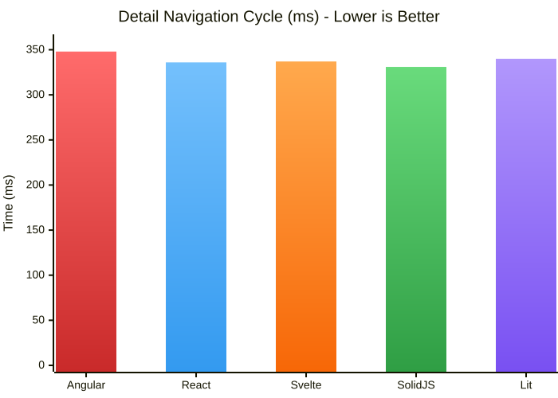

*Note: This test navigates between detail pages (1→2→1). "Total Cycle" is the cumulative time for both navigations.*

| Framework | Total Cycle (ms) | Avg Navigation (ms) |
| --------- | ---------------- | ------------------- |
| Angular   | 348              | 17                  |
| React     | 336              | 12                  |
| Svelte    | 337              | 13                  |
| SolidJS   | **331**          | **10**              |
| Lit       | 340              | 15                  |

**Winner**: SolidJS (331ms total, 10ms avg navigation)

### Bundle Sizes

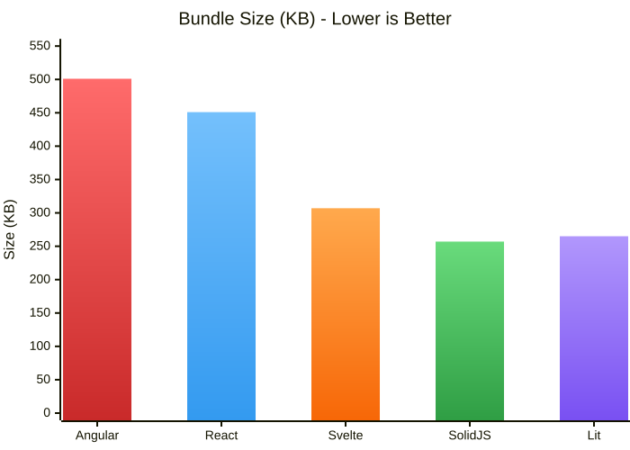

| Framework | Total Bytes | Largest Request | Request Count |
| --------- | ----------- | --------------- | ------------- |
| Angular   | 501 KB      | 253 KB          | 57            |
| React     | 451 KB      | 262 KB          | 54            |
| Svelte    | 307 KB      | **69 KB**       | 75            |
| SolidJS   | **257 KB**  | 71 KB           | 54            |
| Lit       | 265 KB      | 91 KB           | 54            |

**Winner**: SolidJS (257KB) - 49% smaller than Angular, 43% smaller than React

### Overall Comparison

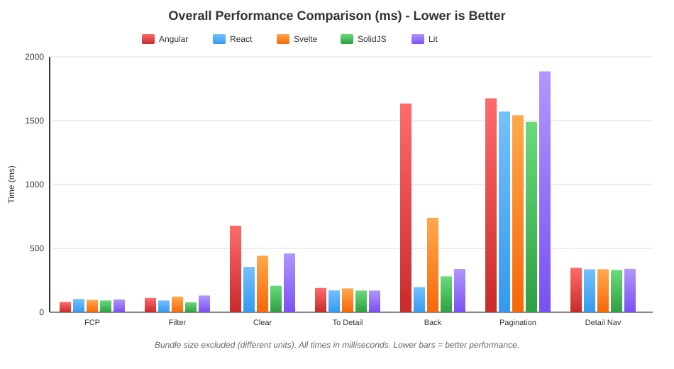

| Framework   | Wins  | Notable Strengths                                   | Notable Weaknesses                      |
| ----------- | ----- | --------------------------------------------------- | --------------------------------------- |
| **SolidJS** | **6** | Fastest filtering, smallest bundle, best pagination | Slightly slower initial FCP             |
| React       | 2     | Excellent back navigation, competitive everywhere   | Larger bundle than Solid/Lit            |
| Angular     | 1     | Fastest initial FCP/LCP                             | Slowest back navigation, largest bundle |
| Svelte      | 0     | Second-smallest bundle, consistent performance      | No category wins                        |
| Lit         | 1     | Tied for detail navigation, small bundle            | Slowest pagination                      |

#### Overall Winner: SolidJS

SolidJS delivers the best overall performance, winning 6 of 8 categories. Its fine-grained reactivity system excels in scenarios involving component updates—filtering, pagination, and detail navigation—while also producing the smallest bundle.

#### Runner-up: React

React performs competitively across all metrics and dominates the "navigate back to list" scenario by a wide margin. Its mature ecosystem and consistent results make it an excellent choice for most applications.

## Limitations

Keep these caveats in mind when interpreting the results:

- **Not about Developer Experience (DX)**: This study focuses purely on runtime performance. It does not evaluate ease of development, debugging, learning curve, or ecosystem maturity.

- **SvelteKit only**: The Svelte implementation uses SvelteKit. Results may differ with vanilla Svelte or alternative meta-frameworks.

- **No Server-Side Rendering (SSR)**: All frameworks were tested as client-side SPAs. SSR performance may differ significantly.

- **Latest versions only**: Tests used the latest stable versions as of December 2025. Older versions may behave differently.

- **Single machine**: All tests ran on one MacBook Pro. Results may vary on different hardware.

- **Synthetic data**: The application uses generated mock data. Real-world apps with complex business logic may show different patterns.

- **High component count**: This test emphasizes scenarios with many components. Applications with fewer, more complex components may yield different results.

- **AI-assisted development**: [Claude Code](https://claude.ai/code) was used to help build each framework implementation, ensuring modern best practices and idiomatic patterns for each framework's latest version.

## Resources

- **Source Code**: [github.com/arobinson/FrontEndComparison](https://github.com/arobinson/FrontEndComparison)
- **Raw Data**: [Aggregated CSV](RawData/aggregated-2025-12-14T00-38-38-281Z.csv) | [Full Results JSON](RawData/results-2025-12-14T00-38-38-281Z.json)
